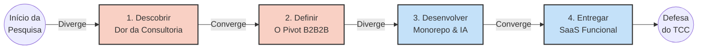

# Duplo Diamante (Design Thinking) - Anjo Nexus

O **Duplo Diamante** ilustra como o Anjo Nexus evoluiu de uma ideia básica (um buscador de editais) para uma plataforma B2B2B complexa (um OS para consultorias).

## 💎 O Fluxo de Inovação do Projeto

## Fases do Duplo Diamante

### 1. Descobrir (Divergência) - *Mapeando o Mercado*
* **Hipótese Inicial:** Startups não encontram editais. Precisamos fazer um buscador (B2C) como o Agente Capta.
* **A Descoberta:** Ao analisar o mercado, descobrimos que achar o edital é apenas 20% do problema. Os outros 80% são a burocracia de gerenciar arquivos e escrever a proposta. Quem sofre com isso são as **Consultorias de Inovação** que atendem essas startups.
* **Validação:** Criação do `Mvp_anjo` para testar se conseguiríamos extrair dados das FAPs com o *RoachPHP*.

### 2. Definir (Convergência) - *O Pivot B2B2B*
* **A Decisão:** Abandonamos a ideia de ser só um buscador. O Anjo Nexus será um **Sistema Operacional para Consultorias**, integrando gestão de startups (Kanban) e Inteligência Artificial.
* **Ação:** Criação dos Artefatos de 001 a 004 (Mapeamento de Casos de Uso focados no Consultor, Diagrama de Classes do Monorepo e Diagramas de Sequência assíncronos).

### 3. Desenvolver (Divergência) - *A Arquitetura*
* **A Execução:** Início das Sprints de código lideradas por Ademar e Pedro.
* **Tecnologias:** Laravel 11 para suportar Jobs/Webhooks pesados, Vanilla JS para um frontend enxuto. Integração pesada com Google Gemini (para redigir a minuta da proposta) e Mercado Pago (assinaturas).

### 4. Entregar (Convergência) - *O Produto Fim-a-Fim*
* **A Entrega:** Um SaaS onde o consultor entra, o sistema puxa editais de 27 estados, dá *Match* automático com o portfólio de startups do consultor, abre um Kanban e escreve a minuta base sozinho.
* **Validação Final:** Testes E2E (liderados pelo Roberto) e homologação para a apresentação impecável na banca do TCC.
