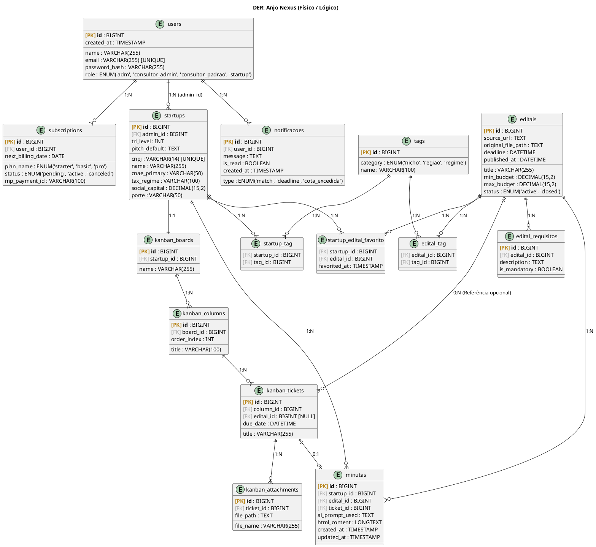

# Diagrama Entidade-Relacionamento (DER) Físico e Lógico

Este documento contém o modelo de banco de dados relacional para a plataforma **Anjo Nexus**, extraído rigorosamente a partir dos 44 Casos de Uso detalhados.

O diagrama abaixo está no formato **PlantUML** e descreve as tabelas físicas, tipos de dados (lógicos), Chaves Primárias (PK) e Chaves Estrangeiras (FK).

### Como Visualizar:
Copie o bloco de código acima e cole em um renderizador online como o [PlantText](https://www.planttext.com/) ou utilize uma extensão de visualização PlantUML no VS Code.

