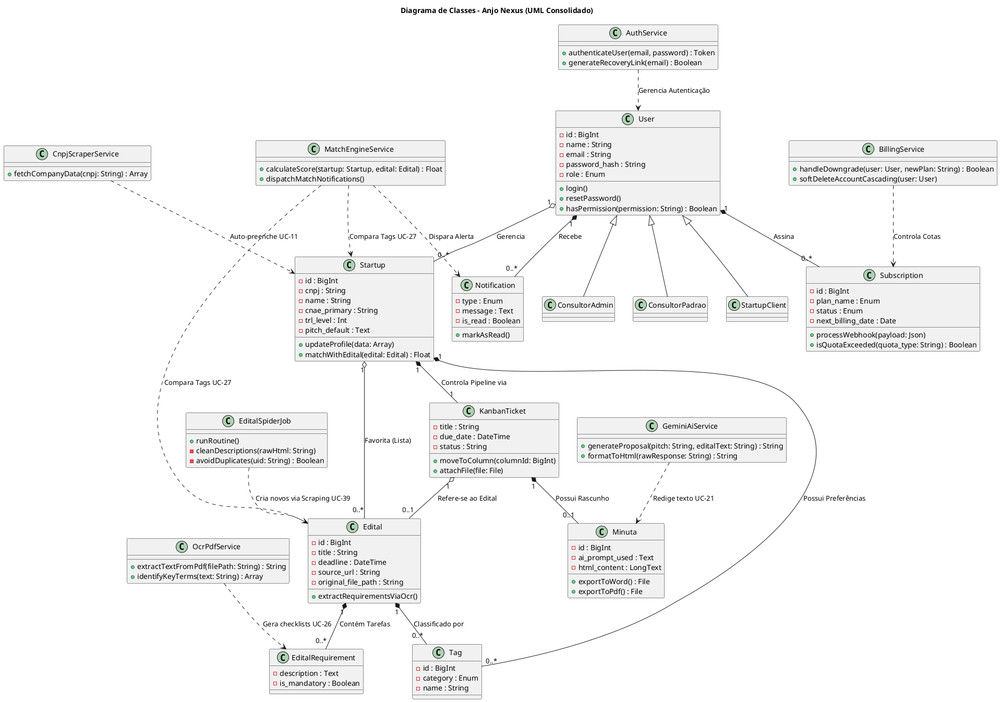

# Diagrama de Classes (Sistema Único)

Este documento contém o Diagrama de Classes consolidado para todo o sistema **Anjo Nexus**, cobrindo o painel Administrativo Global, Consultores, Startups, Web Scraping, IA e Gestão Kanban.

O diagrama segue a notação **PlantUML**, mapeando as Models (Entidades) primárias e as classes de Serviço (Services) e Controladores (Controllers) que orquestram os 44 Casos de Uso.

### Como Visualizar:
Copie o bloco de código acima e cole em um renderizador online como o [PlantText](https://www.planttext.com/) ou utilize uma extensão de visualização PlantUML no VS Code.
